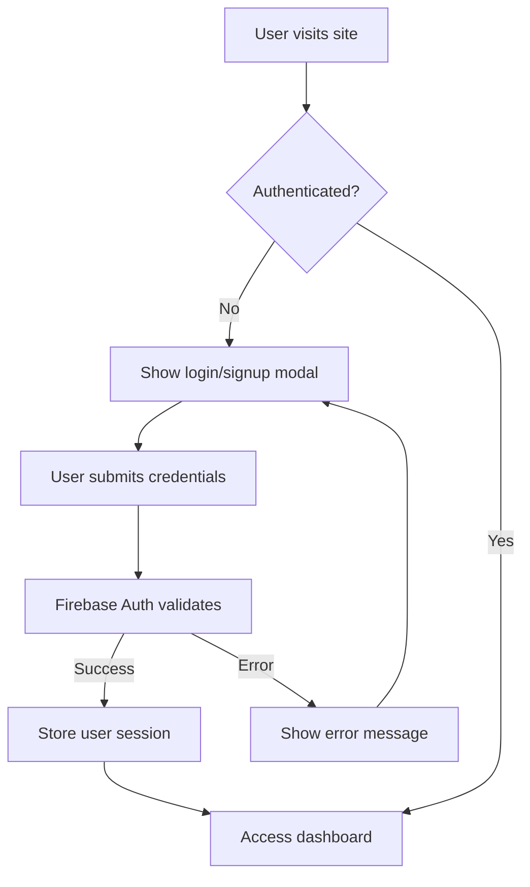

# Firebase Authentication Implementation

## 🚀 Features Implemented

### ✅ Core Authentication
- **Email/Password Registration** - Users can create accounts with email and password
- **Email/Password Login** - Secure login with Firebase Auth
- **Google OAuth** - One-click sign-in with Google accounts
- **Session Management** - Persistent login sessions across browser sessions
- **Protected Routes** - Automatic redirection for unauthenticated users
- **Logout Functionality** - Secure logout with session cleanup

### ✅ User Experience
- **Loading States** - Visual feedback during authentication processes
- **Error Handling** - User-friendly error messages for all auth scenarios
- **Form Validation** - Real-time validation with helpful feedback
- **Responsive Design** - Works seamlessly on desktop and mobile
- **Dark Mode Support** - Authentication UI adapts to theme

### ✅ Security Features
- **Firebase Security** - Built-in protection against common attacks
- **Input Sanitization** - All user inputs are validated and sanitized
- **Secure Token Management** - Firebase handles JWT tokens securely
- **Password Requirements** - Minimum 6 characters enforced
- **Rate Limiting** - Firebase provides built-in rate limiting

## 📁 File Structure

```
├── lib/
│   └── firebase.ts                 # Firebase configuration
├── hooks/
│   └── use-firebase-auth.ts        # Authentication hook
├── components/
│   ├── auth-provider.tsx           # Auth context provider
│   ├── auth-modal.tsx              # Login/signup modal
│   ├── protected-route.tsx         # Route protection wrapper
│   ├── loading-spinner.tsx         # Loading component
│   └── header.tsx                  # Updated header with auth
├── app/
│   ├── layout.tsx                  # Root layout with AuthProvider
│   └── dashboard/
│       └── page.tsx                # Protected dashboard
├── .env.local.example              # Environment variables template
├── FIREBASE_SETUP.md               # Setup instructions
└── AUTH_README.md                  # This file
```

## 🔧 How It Works

### 1. Authentication Flow



### 2. Component Architecture

- **AuthProvider**: Wraps the entire app, provides auth context
- **useAuth Hook**: Manages authentication state and methods
- **AuthModal**: Handles login/signup UI and form submission
- **ProtectedRoute**: Wraps protected pages, redirects if not authenticated
- **Header**: Shows user info when logged in, auth buttons when not

### 3. Firebase Integration

- **Authentication**: Email/password and Google OAuth
- **Firestore**: Stores user profile data
- **Security Rules**: Protects user data access
- **Real-time Updates**: Auth state changes are instantly reflected

## 🎯 Usage Examples

### Basic Authentication Check
```typescript
import { useAuth } from '@/hooks/use-firebase-auth'

function MyComponent() {
  const { user, loading } = useAuth()
  
  if (loading) return <LoadingSpinner />
  if (!user) return <div>Please log in</div>
  
  return <div>Welcome, {user.displayName}!</div>
}
```

### Protecting a Route
```typescript
import { ProtectedRoute } from '@/components/protected-route'

export default function DashboardPage() {
  return (
    <ProtectedRoute>
      <DashboardContent />
    </ProtectedRoute>
  )
}
```

### Manual Authentication
```typescript
import { useAuth } from '@/hooks/use-firebase-auth'

function LoginForm() {
  const { signIn, signUp, signInWithGoogle, error } = useAuth()
  
  const handleLogin = async () => {
    try {
      await signIn(email, password)
      // User is automatically redirected
    } catch (error) {
      // Error is handled by the hook
    }
  }
}
```

## 🔒 Security Considerations

### What's Protected
- **User Data**: Only authenticated users can access their own data
- **Protected Routes**: Dashboard and user-specific pages require authentication
- **API Calls**: Firebase automatically includes auth tokens
- **Session Management**: Secure token storage and refresh

### Best Practices Implemented
- **No sensitive data in localStorage**: Firebase handles secure token storage
- **Input validation**: All forms validate data before submission
- **Error handling**: Generic error messages prevent information leakage
- **HTTPS enforcement**: Firebase requires HTTPS in production
- **CORS protection**: Firebase handles cross-origin requests securely

## 🚨 Error Handling

The system handles these common scenarios:

- **Invalid credentials**: "Invalid email or password"
- **Email already exists**: "An account with this email already exists"
- **Weak password**: "Password should be at least 6 characters"
- **Network errors**: "Network error. Please check your connection"
- **Rate limiting**: "Too many failed attempts. Please try again later"
- **Popup blocked**: "Sign-in was cancelled"

## 🔄 State Management

### Auth Context Structure
```typescript
interface AuthContextType {
  user: User | null           // Current user object
  loading: boolean           // Loading state
  signUp: Function          // Email/password registration
  signIn: Function          // Email/password login
  signInWithGoogle: Function // Google OAuth
  logout: Function          // Sign out
  error: string | null      // Current error message
  clearError: Function      // Clear error state
}
```

### User Object Properties
```typescript
interface User {
  uid: string              // Unique user ID
  email: string           // User's email
  displayName: string     // User's full name
  photoURL: string        // Profile picture URL
  emailVerified: boolean  // Email verification status
}
```

## 🧪 Testing

### Manual Testing Checklist
- [ ] Email/password signup creates new user
- [ ] Email/password login works with correct credentials
- [ ] Login fails with incorrect credentials
- [ ] Google sign-in opens popup and authenticates
- [ ] User session persists after page refresh
- [ ] Protected routes redirect unauthenticated users
- [ ] Logout clears session and redirects to home
- [ ] Error messages display correctly
- [ ] Loading states show during auth operations
- [ ] Form validation prevents invalid submissions

### Test User Accounts
Create test accounts for different scenarios:
- Valid email/password user
- Google OAuth user
- User with long name (test UI truncation)

## 🚀 Deployment

### Environment Variables
Ensure these are set in production:
```env
NEXT_PUBLIC_FIREBASE_API_KEY=your_production_api_key
NEXT_PUBLIC_FIREBASE_AUTH_DOMAIN=your_project.firebaseapp.com
NEXT_PUBLIC_FIREBASE_PROJECT_ID=your_project_id
NEXT_PUBLIC_FIREBASE_STORAGE_BUCKET=your_project.appspot.com
NEXT_PUBLIC_FIREBASE_MESSAGING_SENDER_ID=your_sender_id
NEXT_PUBLIC_FIREBASE_APP_ID=your_app_id
```

### Firebase Console Setup
1. Add production domain to authorized domains
2. Update OAuth redirect URIs
3. Set up proper Firestore security rules
4. Monitor authentication logs

## 🔮 Future Enhancements

### Potential Additions
- **Email Verification**: Require email verification for new accounts
- **Password Reset**: Allow users to reset forgotten passwords
- **Two-Factor Authentication**: Add TOTP or SMS-based 2FA
- **Social Logins**: Add Facebook, Twitter, GitHub OAuth
- **Account Linking**: Allow users to link multiple auth providers
- **Admin Panel**: Manage users and authentication settings
- **Audit Logs**: Track authentication events for security

### Performance Optimizations
- **Code Splitting**: Lazy load authentication components
- **Caching**: Cache user profile data
- **Offline Support**: Handle authentication when offline
- **Bundle Size**: Optimize Firebase imports

## 📞 Support

### Common Issues
1. **Authentication not working**: Check environment variables and Firebase config
2. **Google sign-in fails**: Verify OAuth configuration and authorized domains
3. **Protected routes not working**: Ensure AuthProvider wraps the app
4. **User data not persisting**: Check Firestore security rules

### Debug Steps
1. Check browser console for errors
2. Verify Firebase project configuration
3. Test with different browsers/devices
4. Check Firebase Console for authentication logs
5. Validate environment variables are loaded

This authentication system provides a solid foundation for secure user management in the KoinFile crypto tax platform. It's production-ready and follows Firebase best practices for security and user experience.